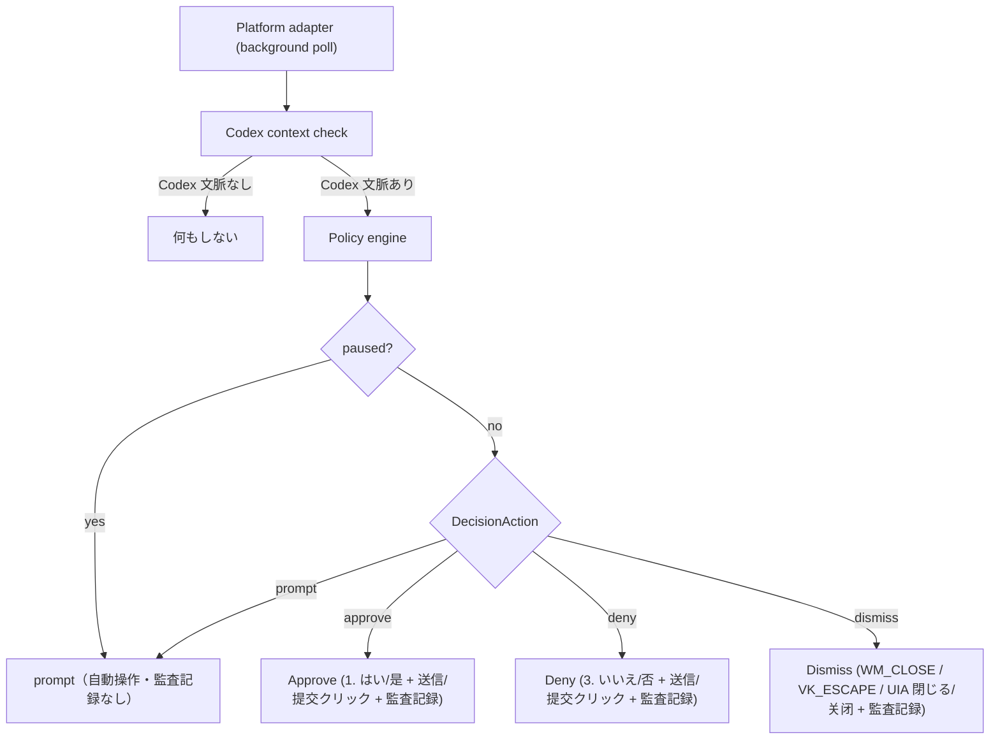

# Architecture

`codex-approval-guard` は、Codex の承認疲れを減らすための Windows / macOS 向けデスクトップ補助ツールです。Codex 承認ウィンドウをバックグラウンドで監視し、検出された承認要求を自動でクリック（承認）します。緊急停止（pause）と監査ログによって、利用者がいつでも介入・追跡できる状態を保ちます。

## 構成

| Layer | 技術 | 役割 |
| --- | --- | --- |
| Desktop shell | Tauri v2 | ウィンドウ、配布、ネイティブ bridge |
| UI | React / TypeScript | 監視状態、観察結果、監査ログの操作画面 |
| Core | Rust | 承認リクエスト判定、監査、redaction |
| Parser | Rust fixtures | UI Automation raw text から command / cwd / target path を抽出 |
| Windows adapter | UI Automation / Win32 | Codex 承認ウィンドウの検出と自動操作（承認・拒否・閉鎖）の実行（UIA、WM_CLOSE、VK_ESCAPE の併用） |
| macOS adapter | Accessibility API | 後続フェーズで検出を担当（現在は未接続） |

## 判定フロー

## 境界

- 対象 platform は Windows と macOS のみです。
- Codex 以外のウィンドウは承認対象にしません。
- Parser は `Codex` を含まない approval / yes-no dialog を無視します。
- ボタン文言だけでは承認しません（UI Automation の承認文脈検出を必須とします）。
- Windows observer は UI Automation で承認文脈を検出し、paused でなければ判定（Approve / Deny / Dismiss）に応じて自動操作を実行します。
  - Approve: 「1. はい/是」と「送信/提交」ボタンを順に Invoke/クリックします。
  - Deny: 「3. いいえ/否」と「送信/提交」ボタンを順に Invoke/クリックします。
  - Dismiss: git commit ダイアログを閉じます。独立 HWND の場合は `WM_CLOSE` を送信し、WebView 内蔵 modal の場合は Escape キー（`VK_ESCAPE`）イベントを親・子 HWND に送信、失敗時は UIA の「閉じる/キャンセル(关闭/取消)」クリックへとフォールバックします。
- 緊急停止（paused = true）の間は自動操作を行わず、policy 判定は `prompt` を返します。
- macOS Accessibility adapter はまだ未接続です。
- 監査ログは自動操作（承認・拒否・閉鎖）の実行時に JSONL で追記保存します。理由（reason）には、成功した自動操作の経路（method。例：`wm-close`, `escape-multi[attach-focus+sendinput+broadcast]`, `uia-recommended-option`, `uia-yes-button`, `uia-no-button`, `uia-close-button`）が追跡用に記録されます。また、機微情報に見える語句（token, secret, password, credential）は記録前に redaction します。

## Parser fixture

`src-tauri/fixtures/ui_text` に UI Automation raw text の positive / negative fixture を置きます。positive は Codex 承認文脈から command、cwd、target path を抽出できることを確認します。negative は UAC、ブラウザ権限、VPN などの一般的な Yes / Allow dialog を誤検出しないことを確認します。

監査ログは自動操作の実行時に JSONL に追記し、保存時には token、secret、password、credential に見える語句を redaction（`[REDACTED]` に置換）します。
